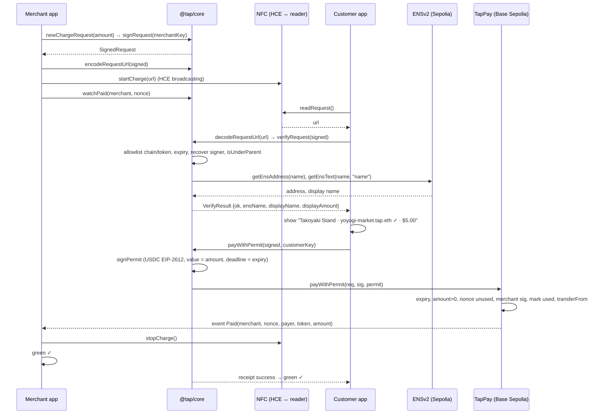

# 02 · Architecture

## System at a glance

```
            ┌───────────── Merchant phone (Android) ─────────────┐
            │  apps/mobile  (merchant screens)                   │
            │     │ uses                                         │
            │  @tap/react-native  ── useCharge / startCharge ──► HCE (NFC Type 4 tag)
            │     │ uses                                         │         │
            │  @tap/core  ── newChargeRequest / signRequest ─────┤         │ tap
            │             ── encodeRequestUrl / watchPaid        │         ▼
            └────────────────────────────────────────────────────┘  ┌───────── Customer phone (Android) ─────────┐
                     ▲                                               │  apps/mobile  (customer screens)           │
                     │ Paid event                                    │  @tap/react-native ── readRequest (reader) │
                     │                                               │  @tap/core ── decodeRequestUrl             │
   ┌──────── Base Sepolia (84532) ────────┐                          │            ── verifyRequest ──────────┐    │
   │  TapPay.sol   ◄── payWithPermit ─────┼──────────────────────────┤            ── payWithPermit          │    │
   │  USDC (permit)                       │                          └────────────────────────────────────────┼────┘
   └──────────────────────────────────────┘                                                                   │
                                                                                                              │ resolve
   ┌──────── Sepolia (11155111) — ENSv2 ───────────────────────────────────────────────────────────────┐    │
   │  Universal Resolver ◄─────────────────────────────────────────────────────────────────────────────┼────┘
   │  ETHRegistry ── tap.eth ──► UserRegistry (ours) ──► yoyogi-market, … (subnames)                     │
   │                   └── resolver: PermissionedResolver (ours): addr + "name" text per subname        │
   │  TapMerchantRegistrar (ours) ── holds EAC roles: REGISTRAR on UserRegistry, SET_ADDRESS/TEXT on resolver │
   └────────────────────────────────────────────────────────────────────────────────────────────────────┘
```

**Three layers, one direction of dependency:**

| Layer | Package | Knows about | Must not know about |
|---|---|---|---|
| Protocol logic | `@tap/core` | EIP-712, ENS, contracts, chains, amounts | React Native, Expo, NFC, UI |
| Transport | `@tap/react-native` | NFC (HCE + reader), React hooks | Keys beyond passing them through, contract addresses, viem internals |
| UI | `apps/mobile` | Screens, navigation, secure storage | viem, ABIs, addresses, signing, ENS |

Dependencies only point downward: `apps/mobile → @tap/react-native → @tap/core`. The mobile app may also import `@tap/core` directly for pure helpers (formatting, types). Enforced by `scripts/check-architecture.ts` (see `09-quality-and-commits.md`).

## Top-level repo layout
The full canonical tree is in `CLAUDE.md` → *Repository layout*. At a glance:

| Folder | What's inside | Owner |
|---|---|---|
| `docs/` | This plan. Read before building. | Both |
| `contracts/` | Solidity (Foundry): `TapPay`, `TapMerchantRegistrar`, tests, deploy scripts | SDK track |
| `packages/core/` | `@tap/core`: the protocol SDK, pure TS | SDK track |
| `packages/react-native/` | `@tap/react-native`: NFC transport + hooks | Flow track |
| `apps/mobile/` | The demo app (merchant + customer behind a role picker) | Flow track |
| `apps/server/` | Optional Hono server. Doesn't exist unless a decision adds it. | SDK track |
| `scripts/` | CLI jobs: ENS setup, merchant registration, ABI generation, architecture check, e2e | SDK track |

Rule of thumb: **`packages/` is what other developers would install. `apps/` is what we run. `contracts/` is what lives onchain. `scripts/` is what we run once from a laptop.**

## The payment, step by step



Typical timing: tap → verified screen ~1–2s (two ENS reads on Sepolia), confirm → both screens green ~2–4s (Base Sepolia ~2s blocks).

## Chains
| Purpose | Chain | chainId | Why |
|---|---|---|---|
| Payments | Base Sepolia | `84532` | ~2s blocks, real testnet USDC with permit |
| Merchant identity | Sepolia | `11155111` | ENSv2 is deployed only on Sepolia |

`@tap/core` holds two viem public clients (`paymentClient`, `ensClient`), configured once via `configureTap()`. Wallet (write) clients are created per call from the `LocalAccount` passed in.

## Trust model
**What the customer trusts:** ENSv2 on Sepolia, our `tap.eth` namespace policy, the `TapPay` contract, the SDK's built-in allowlist.
**What the customer does NOT trust:** anything read from the tag.

| Data | Where it comes from | Trusted? |
|---|---|---|
| Merchant address, name, token, amount, nonce, expiry, signature | Tag | ❌ Verified before use |
| TapPay contract address | SDK allowlist (`config/chains.ts`) | ✅ |
| Token symbol + decimals | SDK allowlist | ✅ |
| Merchant name → address | ENSv2 resolution, live | ✅ |
| Merchant display name | ENSv2 text record `name`, live | ✅ |
| Parent namespace (`tap.eth`) | SDK constant | ✅ |

## Threat model
| # | Attack | Defence | Enforced by |
|---|---|---|---|
| T1 | Swapped tag/QR pointing to the attacker's address | Attacker can't make `*.tap.eth` resolve to their address unless they registered that name; the display name shown is the one registered to that address | INV-03, INV-04, ENS registrar |
| T2 | Attacker registers `yoyogi-market.eth` (outside our namespace) | Name must be a direct subname of `tap.eth` | INV-04 |
| T3 | Tampered amount/token/name on a real merchant's tag | Merchant EIP-712 signature covers every field | INV-02, INV-07 |
| T4 | Replaying an old request | Per-merchant nonce, marked used onchain | INV-08 |
| T5 | Replaying on another chain or contract | EIP-712 domain includes `chainId` + `verifyingContract` | INV-09 |
| T6 | Stale request (vendor walked away) | 120s expiry, checked in SDK and contract | INV-05 |
| T7 | Tag points at a fake "TapPay" contract or fake token | Contract and token addresses come from the allowlist, never the tag | INV-06 |
| T8 | Permit front-run (griefing) | `permit` wrapped in try/catch; settlement uses the allowance | Contract test `test_PermitFrontRun_StillSettles` |
| T9 | Lookalike names (`yoyogi-rnarket`) | Out of scope for the hackathon. Mitigation: registration gating (What's next) | — |
| T10 | Stolen merchant phone | Out of scope. Mitigation: `tap.signer` key rotation via EAC (What's next) | — |
| T11 | Default-record fallback: an unregistered `x.tap.eth` resolving through `tap.eth`'s resolver default record | Never write records to the root name on our resolver; `resolveMerchant` treats the zero address as unresolved | ENS setup rule (`04-ens.md`), `ens.test.ts` |

## Configuration
| Setting | Where | Notes |
|---|---|---|
| Contract + token addresses, ENS parent | `packages/core/src/config/chains.ts` | The only place addresses live in TS |
| RPC URLs (app) | `apps/mobile/.env` → `EXPO_PUBLIC_BASE_SEPOLIA_RPC`, `EXPO_PUBLIC_SEPOLIA_RPC` | Bundled into the app. Testnet only, so that's acceptable |
| RPC URLs + keys (scripts) | root `.env` | Never committed |
| Request expiry | `packages/core/src/config/constants.ts` → `REQUEST_TTL_SECONDS = 120` | |

## Error handling
- `@tap/core` throws **typed errors** (`TapDecodeError`, `TapPayError`, `TapConfigError`) with a stable `code`. Verification never throws: it returns `{ ok: false, reason }`.
- `@tap/react-native` hooks catch errors and expose `state: "error"` + `error: { code, message }`.
- The app maps codes to plain-language copy (`07-mobile-app.md` → Copy). It never shows raw RPC errors or hex to the user.
